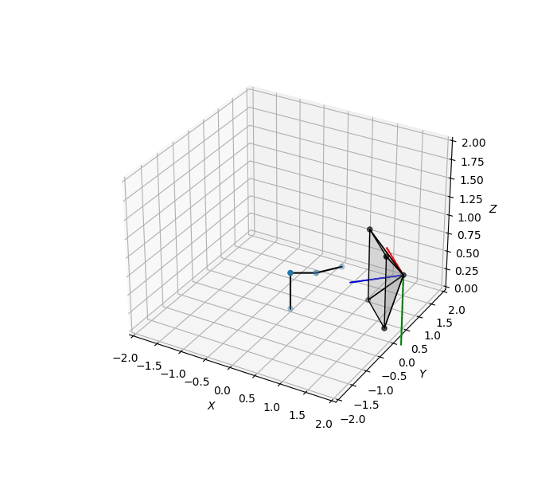
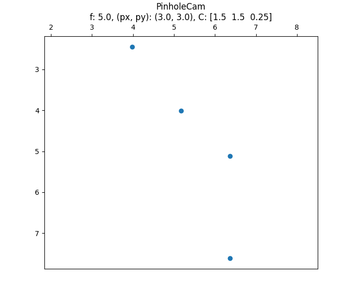

# planar_arm
A simple 3DOF arm simulator with eye-to-hand Uncalibrated Visual Servoing (UVS), implemented using python and numpy.

  
  

## Table of Contents
- [planar_arm](#planar-arm)
  - [Table of Contents](#table-of-contents)
  - [Requirements](#requirements)
  - [Usage](#usage)
  - [Methods](#methods)
    - [Forward Kinematics](#forward-kinematics)
    - [Uncalibrated Visual Servoing](#uncalibrated-visual-servoing)
    - [Camera Models](#camera-models)
  - [References](#references)

## Requirements
- python3
- numpy
- matplotlib

## Usage
To start the simulator, in a terminal, run `python3 main.py`.

Both the arm environment and the camera models are initialized in `main.py`. Arm3D supports mixtures between PinholeCamera and CCDCamera. 

The simulated arm is hooked up with 6 keys on keyboard, which will adjust the goal position of the arm by a small value in x, y and z direction. Every time a goal position is adjusted, Uncalibrated Visual Servoing (UVS) is invoked to move the arm to the goal position.

In addition, a `f_report.txt` file can be generated to record the numerical stability of each convergence.

## Methods
### Forward Kinematics
Forward kinematics is the problem of determining the position of the robot joints (or only the end-effector), given the joint angles. There are two ways to describe the arm kinematics: (1) By successive geometric translation and rotation, as described [here#P13](http://ugweb.cs.ualberta.ca/~vis/courses/robotics/lectures/2021/Lec07ArmKinematics.ppt); (2) By using Denavit-Hartenberg (DH) parameters.

The forward kinematics of the 3DOF arm is implemented in [arm3d.py#L26](https://github.com/cjiang2/planar_arm/blob/main/arm/arm3d.py#L26), using DH parameters.

### Uncalibrated Visual Servoing
We will apply Uncalibrated Visual Servoing (UVS) to solve the Inverse Kinematics for the arm.

Uncalibrated Visual Servoing (UVS) is a technique that gives a direct mapping from image space to robot joint space. 

We define  as the configuration of  joints (N DOFs) robot, and  as  visual features currently tracked from camera. The visual-motor function  that relates the image space to robot joints can be defined as: 

  

By taking the derivative, we get:

  

where we acquire the visual-motor Jacobian , and the robot control input . 

By replacing  with , we can have the approximation: 

  

Now the proportional control law can be formulated as: 

  

where  is the Moore-Penrose pseudoinverse of , and  is the desired visual features in image space. 

The initial visual-motor Jacobian is estimated by [orthogonal exploratory motions](https://www.sciencedirect.com/science/article/pii/S0921889097000523), implemented in [visual_servoing.py#L3](https://github.com/cjiang2/planar_arm/blob/main/arm/visual_servoing.py#L3). Afterwards, the Jacobian can be updated iteratively using Broyden's Method, formulated as follows:

  

A simple UVS routine is implemented in [visual_servoing.py#L33](https://github.com/cjiang2/planar_arm/blob/main/arm/visual_servoing.py#L33). 

### Camera Models
The simulator supports two types of camera models: pinhole camera and CCD camera. 

## References
Some book references I keep here:

[Uncalibrated Visual Servoing](http://webdocs.cs.ualberta.ca/~vis/robotics/uncalib/uncalibvs.htm)

[Intriduction to Robotics: Mechanics and Control](http://www.mech.sharif.ir/c/document_library/get_file?uuid=5a4bb247-1430-4e46-942c-d692dead831f&groupId=14040)

[Multiple View Geometry in Computer Vision Second Edition](https://www.robots.ox.ac.uk/~vgg/hzbook/)
